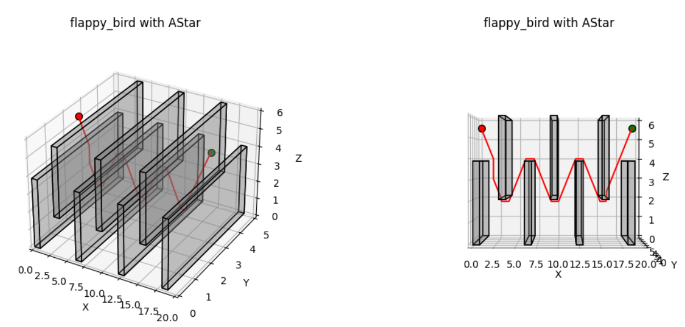
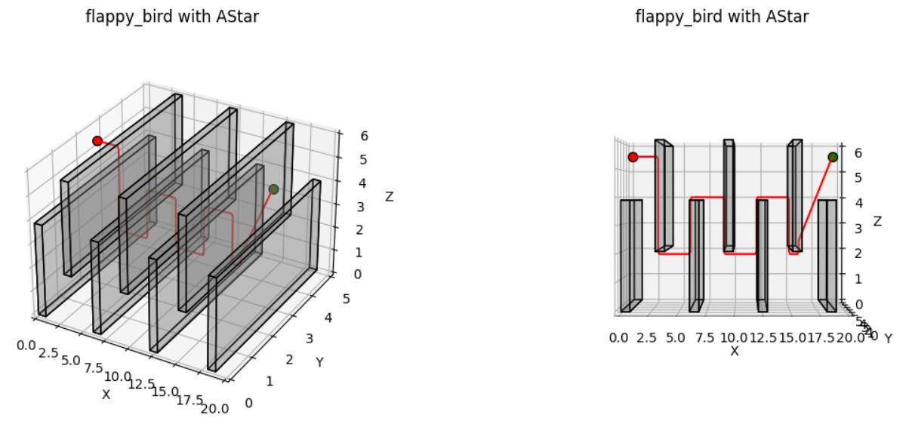
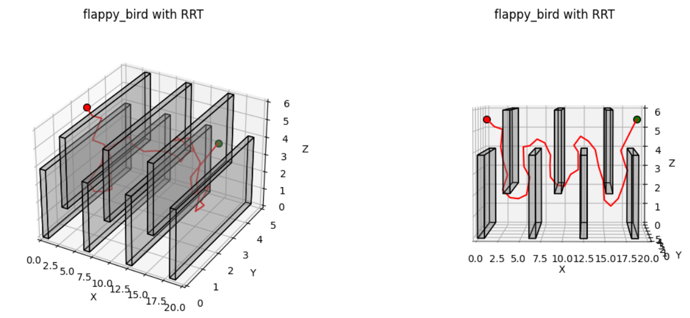

# ECE276B PR2 SP23 Motion Planning

## Overview
In this assignment, you will implement and compare the performance of search-based and sampling-based motion planning algorithms on several 3-D environments.

## Installation
- Install dependencies
```bash
pip install -r requirements.txt
```

## Run code:
```bash
python3 main.py [-h] [-r RES] [-m MAP] [-e EPS] [-p PLAN] [--r R] [--max_samples MAX_SAMPLES] [--rewire_count REWIRE_COUNT]
```
- RES: resolution for discrtize the environment, default 0.1
- MAP: which map to use [single_cube, maze, window, tower, flappy_bird, room, monza], default single_cube
- EPS: epsilon for weighted A*, default 1.0
- PLAN: Planning algorithm to use [AStar, RRT, RRTStar, RRTConnect], default AStar
- R: length of smallest edge to check for intersection with obstacles in RRT series, default 0.025
- MAX_SAMPLES: max number of samples to take before timing out in RRT series, default 50000
- REWIRE_COUNT: number of nearby branches to rewire in RRT*, default 32

### Example usage:
```bash
python main.py --map monza --plan AStar --eps 5.0 
python main.py --map tower --plan RRT
```

## Source code description:
- **main.py**: Main function.
- **Planner.py**: Path planning algorithms.
- **Collision.py**: Collision detection algorithm.
- **testmap.py**: Functions for testing.
- **utils.py**: Functions for file loading, env plotting, parsing args commands.

## Some results
- AStar with epsilon=1

- AStar with epsilon=5

- RRT


Other results can be found in [report.pdf](./report.pdf)


## Reference
The RRT series algorithms used in this project are from this github repo: https://github.com/motion-planning/rrt-algorithms.


